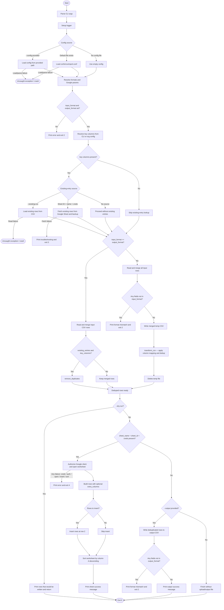

# csvimport Runtime Workflow

This diagram reflects the control flow in `csvimport.py` `main()`.

```mermaid
flowchart TD
  A([Start]) --> B[Parse CLI args]
  B --> C[Setup logger]
  C --> D{Config source}

  D -->|--config provided| E[Load config from provided path]
  D -->|Default file exists| F[Load confs/csvimport.conf]
  D -->|No config file| G[Use empty config]

  E -->|Load/parse failure| CFGERR([Uncaught exception / crash])
  E --> H[Resolve formats and Google params]
  F -->|Load/parse failure| CFGERR
  F --> H
  G --> H

  H --> I{input_format and output_format set?}
  I -->|No| IERR[Print error and exit 2]
  I -->|Yes| J[Resolve key columns from CLI or org config]

  J --> K{key columns present?}
  K -->|No| M[Skip existing-entry lookup]
  K -->|Yes| L{Existing entry source}

  L -->|--existing-csv| L1[Load existing rows from CSV]
  L1 -->|Read failure| CSVERR([Uncaught exception / crash])
  L -->|Sheet ID + name + creds| L2[Fetch existing rows from Google Sheet and backup]
  L -->|No source| L3[Proceed without existing entries]
  L2 -->|Fetch failure| LERR[Print troubleshooting and exit 3]

  L1 --> N
  L2 --> N
  L3 --> N
  M --> N

  N{input_format == output_format?}
  N -->|Yes| O[Read and merge input CSV rows]
  O --> P{existing_entries and key_columns?}
  P -->|Yes| Q[remove_duplicates]
  P -->|No| R[Keep merged rows]

  N -->|No| S[Read and merge all input rows]
  S --> T{Any fields not in input_format?}
  T -->|Yes| TERR[Print format mismatch and exit 2]
  T -->|No| U[Write merged temp CSV]
  U --> V[transform_csv — apply column mapping and dedup]
  V --> VCLEAN[Delete temp file]

  Q --> W[Deduped rows ready]
  R --> W
  VCLEAN --> W

  W --> DR{--dry-run?}
  DR -->|Yes| DRP[Print rows that would be written and return]
  DR -->|No| X{sheet_name + sheet_id + creds present?}

  X -->|Yes| Y[Authorize Google client and open worksheet]
  Y --> Z[Build rows with optional extra_columns]
  Z --> AA{Rows to insert?}
  AA -->|Yes| AB[Insert rows at row 2]
  AA -->|No| AC[Skip insert]
  AB --> AD[Sort worksheet by column A descending]
  AC --> AD
  AD --> AE[Print sheet success message]
  Y -->|Any failure: creds / auth / open / insert / sort| AERR[Print error and exit 4]

  X -->|No| AF{--output provided?}
  AF -->|Yes| AG[Write deduplicated rows to output CSV]
  AG --> AH{Any fields not in output_format?}
  AH -->|Yes| AHERR[Print format mismatch and exit 2]
  AH -->|No| AI[Print output success message]
  AF -->|No| AJ[Finish without upload/output file]

  DRP --> END([Exit 0])
  AE --> END
  AI --> END
  AJ --> END
```
